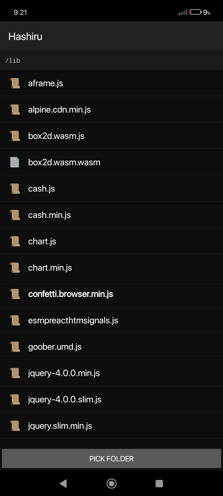
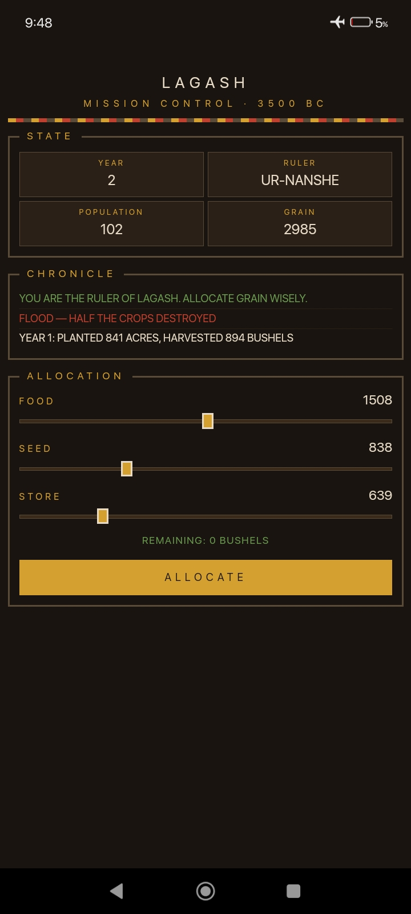

## hashiru

hashiru (走る) is a minimal Android viewer for local HTML applications and plain-text md documentation, for quickly building and setting up custom apps for personal use, inspired by Termux-GUI and APDE
. Renders any HTML file from user-selected storage with its sibling JS, CSS, fonts, and images intact, using a loopback HTTP server bound to 127.0.0.1.

  

## Features

Each opened HTML file spawns an embedded NanoHTTPD instance on an ephemeral port. The WebView requests the document and all relative assets over http://127.0.0.1, which bypasses the file:// origin restrictions that break relative paths and cross-origin fetches in stock WebView. Users grant a single folder via the system folder picker, and persistable URI permission is requested so the grant survives reboots. 

Files and subfolders are enumerated through the Storage Access Framework, requiring no runtime storage permission on any API level. Every HTML document opens in its own task, named by file path, so Recents shows them as separate cards and multiple documents run concurrently with independent server instances. 

Markdown, plain text, org, and twee files (WIP) are intercepted server-side and rendered to themed HTML using CommonMark with GFM tables and strikethrough support, styled with a Dracula palette and per-heading-level colors, while plain-text formats fall back to a monospaced preformatted block. 

Last-read scroll offset is stored per document and restored after page load, keyed by tree URI and relative path so identical filenames in different folders never collide. 

The app also registers as a handler for markdown MIME types, so files opened from other apps render in the reader without going through the folder picker. 

WebView is hardened with file access, content access, and universal access all disabled, path traversal blocked at the server, and cleartext traffic restricted to loopback. 

A native file chooser bridge forwards input elements of type file to the system picker. (WIP)

## Technical notes

- Written in Java with no AndroidX. Only framework classes plus two dependencies, NanoHTTPD and CommonMark with the tables and strikethrough extensions. 
- Release APK stays under 200 KB. Minimum SDK 21, target and compile SDK 34.
- Theme is the framework Material theme with dark defaults, and windowOptOutEdgeToEdgeEnforcement is set for Android 15.
- One LocalFileServer instance runs per WebViewActivity, bound to 127.0.0.1 on an OS-assigned port, rooted at a Storage Access Framework tree URI.
- Document IDs resolve by walking children, and traversal requests are rejected before resolution.
- The reader pipeline inspects file extensions inside the server, reads reader formats into memory, passes them through the renderer, and returns HTML while everything else streams back through a chunked response with a guessed or provider-reported MIME type.
- Scroll positions live in a dedicated preferences file, storing raw scrollY pixels per document. (I plan to use this app primarily for reading my md notes which I take using Acode editor, or reading Karui exports)
- Edge-to-edge handling is conditional: reader pages use a transparent status bar with content drawn underneath and a small injected top padding sized to the status bar height, while HTML apps use solid bars and no injection, since arbitrary page layouts cannot be safely padded without visual regression.
- Landscape mode uses immersive-sticky with display cutout overlay enabled, drawing content into camera cutout regions on supported API levels.
- Build runs on GitHub Actions with Gradle provisioned by the setup-gradle action and no wrapper committed to the repository.

## Uses

- Running single-file browser games, WebGL demos, and WebAssembly prototypes. (WASM WIP)
- Local development and testing of HTML, CSS, and JavaScript bundles without a desktop toolchain. (Would recommend using Acode)
- Reading markdown documentation stored locally with persistent scroll state across sessions.
- Side-loading progressive web app snapshots and offline-first static sites.
- Viewing HTML output from tools that emit self-contained reports such as coverage, benchmarks, and static analyzers.

## Inspiration

Newer androids will feature an AI generated widget feature to allow users to quickly make custom widgets for their needs, I wanted this tech now.

- Termux GUI uses python for making native android UI based custom software, including persistent storage and process-level isolation.
- APDE, Android Processing IDE, demonstrated in-editor authoring and execution of sketch-style programs entirely on-device, without a PC build step, and established that a mobile IDE workflow is usable when the runtime is embedded in the app rather than delegated to an external toolchain.

Hashiru applies the same principle to HTML documents: the runtime lives in the app, relative paths resolve correctly because the server and client share a loopback origin, and the user's existing folder of files becomes the project. No build step, no server configuration, no hosting (only alterntive to this system is to make and host a PWA).

## Screenshots

  
  

## Licenses
Hashiru is being developed under the GPLv3 License.

## Follow the development

See my thought process and approach with other's opinions on telegram: <https://t.me/karuifoss>
This app has been primarily made on my phone with Acode editor with alpine linux terminal.

Github Issues are the fastest way to get in touch, for other means there's gitlab, bluesky, and my dev.to account, all linked in my account page on github and [homepage](https://ronynn.github.io).

If you like the app, don't forget to leave a star ⭐ here on github and let me know your suggestions!
